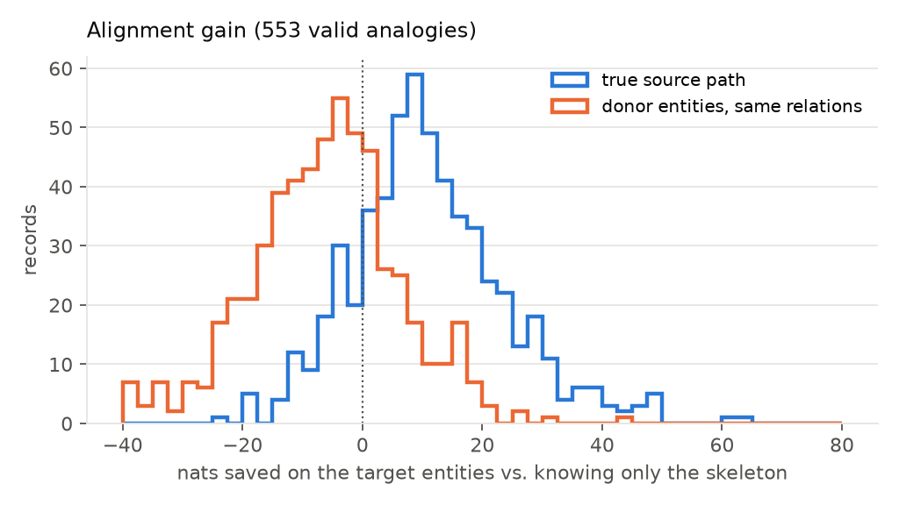
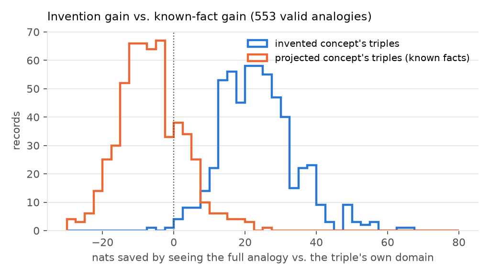
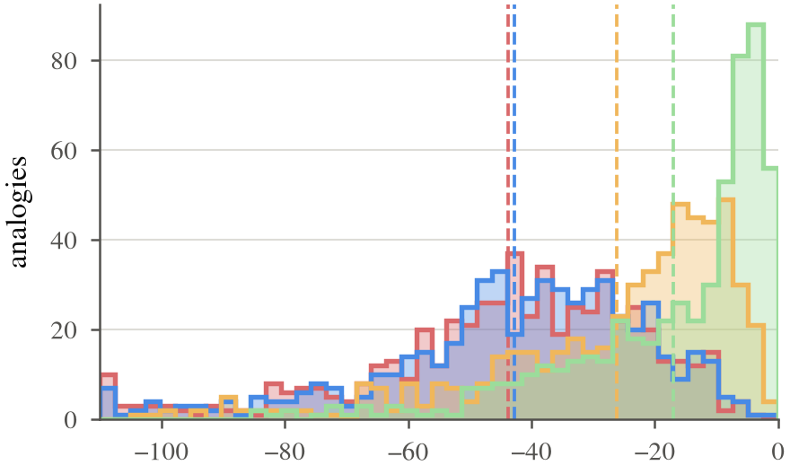
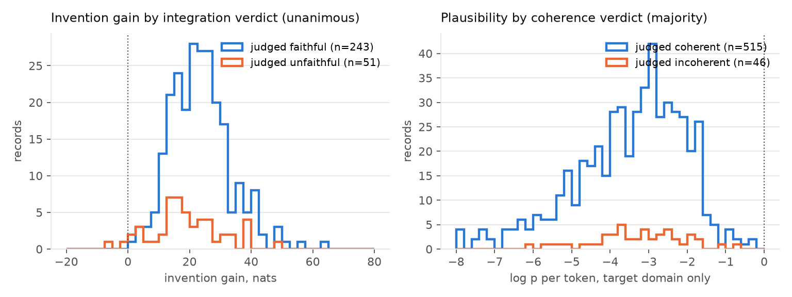
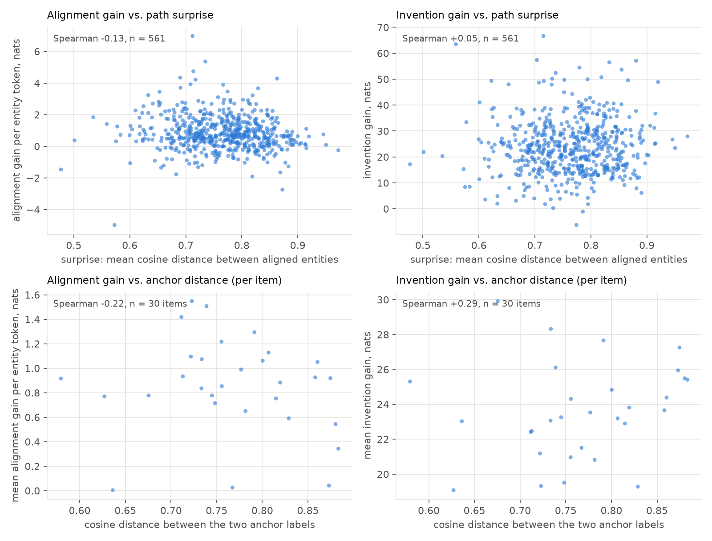
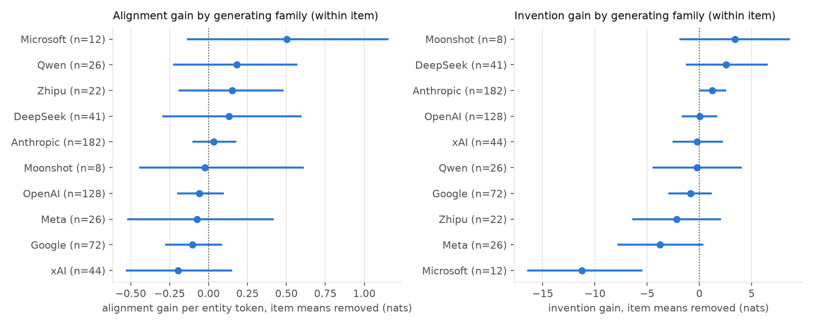
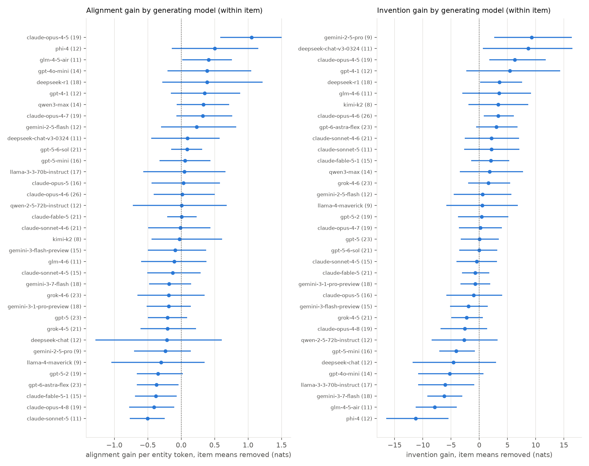
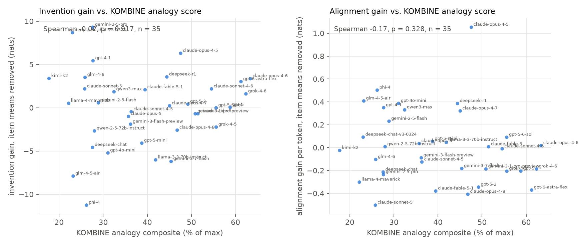
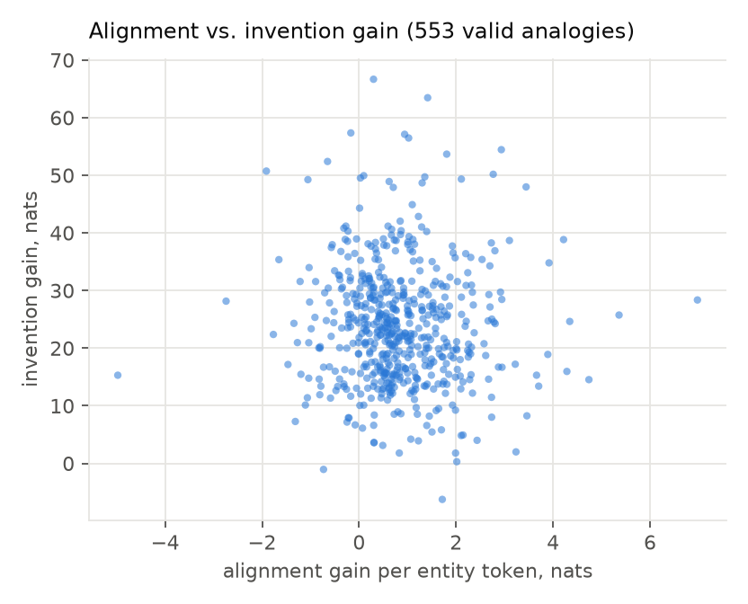
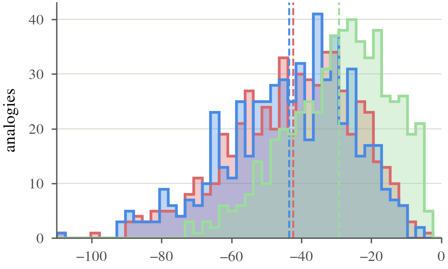

# Do the kinds of information gain an analogy licenses show up in a language model's code lengths?

Date: 2026-09-18. Track: `analogy_ig`. Data: KOMBINE analogies (35 models, 30 items).
Probability model: Qwen2.5-7B-Instruct (8-bit, mlx-lm), held out from the scored systems.
Full extracted examples: `examples_full.md`. Raw results:
`data/analogy_ig/dataset/downstream/logprob_qwen7b_projdir/downstream/{analysis,distance,family,by_model}/results/`
and `downstream/readers_comparison_projdir/results/`.

## The question

The theory memo (`docs/memos/2026-09-18_analogy_information_gain_types.md`) says an analogy
licenses several different information gains, each a different conditional code length. Two of
them can be estimated with nothing but a language model used as a probability model:

- **Alignment gain.** Once the relation skeleton is known, do the source entities make the
  target entities cheaper to write down? That is the substitution dictionary carrying information.
- **Invention gain.** Are the invented concept's triples cheap given the mapping and expensive
  given the target domain alone, in a way that already-known facts are not?

Every number below is minus a log-probability of a string the KOMBINE model actually wrote,
forced token by token after a context. Nothing is generated. Contexts differ only in what they
reveal. A "nat" is one unit of log-probability; larger savings mean the context made the string
more predictable.

## Setup in one table

| What is scored | Context the reader sees | Name used below |
|---|---|---|
| the target path | the target anchor only | anchor only |
| the target path | anchor plus the relation skeleton | skeleton |
| the target path | anchor plus the true source path, asked for the analogous path | true source path |
| the target path | as above, but another item's entities placed on the same relations | donor entities |
| each triple of the invented concept | target path plus the bare name of the invention | target domain only |
| each triple of the invented concept | both paths, the alignment, the projected concept and its facts | full analogy |
| each triple of the projected concept | source path plus the name of the projected concept | source domain only |
| each triple of the projected concept | the full analogy with that one triple withheld | full analogy, triple withheld |

Per-token log-probs are attributed to entity or relation spans, so alignment gain is reported on
entity tokens only (relations are copied by construction in a valid analogy).

### The eight contexts, verbatim, for one analogy

The record is anthropic_claude-opus-4-6 on Existentialism :: The Enlightenment (item E21), the Existential Atlas example
from the qualitative section. The projection runs from the Enlightenment side to the
Existentialism side (the Encyclopedie is an Enlightenment concept), which the corrected contexts
reflect. Each box is the user message the reader sees; the line after "forced target" is the
string whose log-probability is scored, token by token, as the assistant turn. The system message
for the alignment boxes is:

```
You write factual relational paths. A path is a chain of triples, one per line, in the form 'head --relation--> tail', where each line's head is the previous line's tail.
```

and for the invention and known-fact boxes:

```
You state one relational fact as a single triple in the form 'head --relation--> tail'.
```

**anchor only** (alignment gain)

```
Write a 3-triple path describing 'The Enlightenment', starting at 'The Enlightenment'.

forced target:
The Enlightenment --centers on--> Individual Reason
Individual Reason --confronts--> Superstition
Superstition --demands--> Critical Inquiry
```

**skeleton** (alignment gain)

```
Write a 3-triple path describing 'The Enlightenment', starting at 'The Enlightenment', using exactly these relations in this order: 'centers on', 'confronts', 'demands'.

forced target:
The Enlightenment --centers on--> Individual Reason
Individual Reason --confronts--> Superstition
Superstition --demands--> Critical Inquiry
```

**true source path** (alignment gain)

```
Here is a 3-triple path describing 'Existentialism':
Existentialism --centers on--> Individual Consciousness
Individual Consciousness --confronts--> Absurdity
Absurdity --demands--> Authentic Choice

Write the analogous 3-triple path describing 'The Enlightenment', using exactly the same relations in the same order, starting at 'The Enlightenment'.

forced target:
The Enlightenment --centers on--> Individual Reason
Individual Reason --confronts--> Superstition
Superstition --demands--> Critical Inquiry
```

**donor entities** (alignment gain (control))

```
Here is a 3-triple path describing 'Existentialism':
The blues --centers on--> blue notes
blue notes --confronts--> tension
tension --demands--> resolution

Write the analogous 3-triple path describing 'The Enlightenment', using exactly the same relations in the same order, starting at 'The Enlightenment'.

forced target:
The Enlightenment --centers on--> Individual Reason
Individual Reason --confronts--> Superstition
Superstition --demands--> Critical Inquiry
```

**target domain only** (invention gain)

```
Facts about 'Existentialism':
Existentialism --centers on--> Individual Consciousness
Individual Consciousness --confronts--> Absurdity
Absurdity --demands--> Authentic Choice

'Existential Atlas' is a new concept in the domain of 'Existentialism'. State one fact about 'Existential Atlas' as a triple whose head is 'Existential Atlas'.

forced target:
Existential Atlas --systematizes--> Authentic Choice
```

**full analogy** (invention gain)

```
An analogy between 'The Enlightenment' and 'Existentialism'.

Path for 'The Enlightenment':
The Enlightenment --centers on--> Individual Reason
Individual Reason --confronts--> Superstition
Superstition --demands--> Critical Inquiry

Path for 'Existentialism':
Existentialism --centers on--> Individual Consciousness
Individual Consciousness --confronts--> Absurdity
Absurdity --demands--> Authentic Choice

Alignment (position by position):
'The Enlightenment' corresponds to 'Existentialism'
'Individual Reason' corresponds to 'Individual Consciousness'
'Superstition' corresponds to 'Absurdity'
'Critical Inquiry' corresponds to 'Authentic Choice'

'Encyclopédie' is a concept from the domain of 'The Enlightenment' with no counterpart in the domain of 'Existentialism'. Facts about 'Encyclopédie':
Encyclopédie --systematizes--> Critical Inquiry
Encyclopédie --empowers--> Individual Reason
Encyclopédie --undermines--> Superstition

Carrying 'Encyclopédie' across the alignment defines a new concept 'Existential Atlas' in the domain of 'Existentialism'. State one fact about 'Existential Atlas' as a triple whose head is 'Existential Atlas'.

forced target:
Existential Atlas --systematizes--> Authentic Choice
```

**source domain only** (known-fact gain (control))

```
Facts about 'The Enlightenment':
The Enlightenment --centers on--> Individual Reason
Individual Reason --confronts--> Superstition
Superstition --demands--> Critical Inquiry

'Encyclopédie' is a concept in the domain of 'The Enlightenment'. State one fact about 'Encyclopédie' as a triple whose head is 'Encyclopédie'.

forced target:
Encyclopédie --systematizes--> Critical Inquiry
```

**full analogy, triple withheld** (known-fact gain (control))

```
An analogy between 'The Enlightenment' and 'Existentialism'.

Path for 'The Enlightenment':
The Enlightenment --centers on--> Individual Reason
Individual Reason --confronts--> Superstition
Superstition --demands--> Critical Inquiry

Path for 'Existentialism':
Existentialism --centers on--> Individual Consciousness
Individual Consciousness --confronts--> Absurdity
Absurdity --demands--> Authentic Choice

Alignment (position by position):
'The Enlightenment' corresponds to 'Existentialism'
'Individual Reason' corresponds to 'Individual Consciousness'
'Superstition' corresponds to 'Absurdity'
'Critical Inquiry' corresponds to 'Authentic Choice'

'Encyclopédie' is a concept from the domain of 'The Enlightenment' with no counterpart in the domain of 'Existentialism'. Facts about 'Encyclopédie':
Encyclopédie --empowers--> Individual Reason
Encyclopédie --undermines--> Superstition

Carrying 'Encyclopédie' across the alignment defines a new concept 'Existential Atlas' in the domain of 'Existentialism'. State one fact about 'Encyclopédie' as a triple whose head is 'Encyclopédie'.

forced target:
Encyclopédie --systematizes--> Critical Inquiry
```


Two quantities recur:

- **Alignment gain** = nats saved on the target path's entities by seeing the true source path,
  relative to seeing only the skeleton.
- **Invention gain** = nats saved on an invented triple by seeing the full analogy, relative to
  seeing the target domain only. The same difference computed for the projected concept's own
  triples is the **known-fact gain**, the control.

The two KOMBINE panel judges for inventions are called the **integration judge** (was the
mapping actually used to build the invention) and the **coherence judge** (is the invention a
feasible, usable concept). KOMBINE labels the latter "utility".

## Results

### Alignment gain: the specific dictionary carries information (supported)



Given the skeleton, seeing the true source path lowers the cost of the target's entity tokens by
11.1 nats on average (positive in 82% of 561 valid analogies, Wilcoxon p ~ 1e-60). Replacing the
source entities with another item's entities on the same relations removes the gain: the true
source beats the donor in 92% of records, by 17.2 nats on average (p ~ 1e-84). The blue
distribution sits to the right of zero; the orange one sits on it.

Two things alignment gain does **not** do:

- It does not care about truth. Analogies that failed the factuality gate show the same per-token
  alignment gain as valid ones (0.80 vs 0.84, p = 0.58). Utility is a separate reference model.
- Per token, it does not grow with path length (Spearman -0.06, n.s.). The "more skeleton, more
  shared structure" prediction is not supported.

- It does not care whether the relations match either. Analogies whose two paths use different
  relations (so the mapping is not an isomorphism and fails the structural gate) show the same
  per-token alignment gain as valid ones (1.11 vs 0.84, p = 0.44, n = 135 vs 561). The skeleton
  context always used the target path's own relations, so this is a clean comparison.

Taken together: alignment gain measures entity correspondence given the source, and nothing
else. Both KOMBINE gates on the mapping, factuality and relation identity, are invisible to it.
That is consistent with the theory (they are separate reference models) but it also means the
gain is not by itself a validity signal.

### Invention gain: definitions gain from the mapping, facts do not (supported)



The invented concept's triples save 23.7 nats on average when the reader sees the full analogy
rather than the target domain alone. The projected concept's own triples, scored with the same
machinery and the scored triple withheld from the context, lose about 6 nats (the full analogy
distracts from a fact the reader already knows). The invention gains more than the facts in 98%
of analogies (paired Wilcoxon p ~ 1e-93). Known facts are also cheaper in their own domain than
invented triples are in the target (63% of analogies, p = 5e-13). This is the distinction between
projecting a fact and projecting a definition, and it is the cleanest result in the run.

Invention gain does not depend on which way the projection runs: 22.8 nats for the 325 analogies
that project from the first anchor to the second, 23.5 for the 139 that project the other way.

### Invention gain, re-measured: the whole description, four inputs (2026-09-19)

The per-fact measurement above scores one invented triple at a time, and about half to two
thirds of its gain falls on relation tokens that the full analogy has just displayed. The
measurement now used in the paper scores the whole description of the invented concept at once,
as a task with a fixed relational skeleton, so that no input can hand the reader the relations.

The task text fixes the invention's name, its domain, the relations and their order, and asks the
reader to supply the concepts. Four inputs are appended to it, each revealing more of the analogy:

| input | what is appended to the task |
|---|---|
| relational skeleton | nothing |
| analogy instruction | "Use an analogy with the concept <source concept> from the domain of <source>." |
| analogy mapping | the instruction, then both aligned paths with their correspondences |
| analogy content | the source concept's facts, then both aligned paths with their correspondences |

Log-probability of the whole description, one value per analogy averaged over the six readers,
561 valid analogies:

| input | mean log-prob | gain over previous step | positive | Wilcoxon p |
|---|---|---|---|---|
| relational skeleton | -44.0 | | | |
| analogy instruction | -42.8 | +1.2 | 63% | 1e-12 |
| analogy mapping | -26.2 | +16.6 [15.5, 17.7] | 91% | 5e-87 |
| analogy content | -17.0 | +9.2 [8.6, 9.8] | 97% | 1e-90 |

Total gain, content over skeleton: +27.0 nats [25.7, 28.3], positive for 99% of analogies. About
two thirds of it arrives with the aligned paths alone, before any fact about the source concept
is shown (reader range 48% to 74%). Relation tokens contribute nothing under any input (mean
-0.1 nats), so the whole gain is on the concepts the reader has to supply.

Per reader, total gain and its split:

| reader | skeleton | instruction | mapping | content | mapping step | facts step | total |
|---|---|---|---|---|---|---|---|
| Qwen2.5-7B | -42.9 | -41.9 | -22.4 | -15.2 | +19.5 | +7.2 | +27.7 |
| Llama-3.1-8B | -32.7 | -32.6 | -20.1 | -13.3 | +12.5 | +6.9 | +19.5 |
| Mistral-7B | -53.5 | -51.1 | -34.6 | -23.5 | +16.5 | +11.1 | +30.0 |
| Gemma-2-9B | -43.7 | -43.3 | -31.8 | -19.1 | +11.5 | +12.7 | +24.6 |
| Qwen2.5-14B | -51.2 | -47.9 | -24.2 | -13.7 | +23.7 | +10.5 | +37.5 |
| OLMo-2-7B | -40.1 | -40.0 | -23.9 | -17.4 | +16.1 | +6.6 | +22.8 |

The integration judge separates on the total gain under every reader (Cliff's delta 0.25 to
0.44, was 0.19 to 0.27 per fact). Surprise and total gain correlate at +0.07 to +0.10.

Example, Fractional Mandate (three facts), reader-averaged: skeleton -53.5, instruction -45.8,
mapping -22.8, content -10.8.



### The two judges are not the same thing (half supported)



Left: among unanimous panels, invention gain is higher when the three judges agreed the
projection was faithful (23.7 vs 19.1 nats, Cliff's delta 0.24, p = 0.006, n = 243 vs 51). The
integration judge is measuring something a code length can see, though the effect is modest.

Right: nothing separates the coherence judge. Plausibility given the target domain, plausibility
given the full analogy, and invention gain itself all sit on top of each other across the verdict,
whether by unanimity (5 negatives) or majority (46 negatives); every contrast has p > 0.4 and
|delta| < 0.06. Coherence as judged is not a property of the triples' code lengths under this
reader. Either the coherence judge is saturated (515 of 561 True, and its inter-judge reliability
was only fair) or coherence lives at the level of the whole concept, not its triples.

### Gain as a function of semantic distance



Two distances, both already computed by KOMBINE: the surprise of the analogy (mean cosine
distance between aligned entities of the two paths, one value per analogy) and the distance
between the two anchor labels (one value per item; it predicts surprise at Spearman 0.68).

| Relationship | Unit | Spearman | p |
|---|---|---|---|
| alignment gain per token vs. path surprise | analogy (n = 561) | -0.13 | 0.001 |
| same, within item (item means removed) | analogy | -0.15 | 0.0004 |
| invention gain vs. path surprise | analogy | +0.05 | 0.26 |
| same, within item | analogy | +0.10 | 0.02 |
| known-fact gain vs. path surprise | analogy | -0.04 | 0.30 |
| alignment gain vs. anchor distance | item (n = 30) | -0.22 | 0.24 |
| invention gain vs. anchor distance | item | +0.29 | 0.12 |

Alignment gain falls as the aligned entities get further apart. That is what the theory says
surprise is: the code length of the substitution dictionary under a semantic-proximity prior.
Distant substitutions are less predictable from the source, so the source path buys fewer bits
on the target's entities. The effect is small but it survives removing item means, so it is not
a property of which pair was asked; it is a property of the model's choice of mapping within a
pair.

Invention gain moves the other way, weakly and only within item (+0.10, p = 0.02): given the
pair, a more distant mapping produces an invention that gains slightly more from the mapping.
The known-fact control shows no relationship, as it should.

Anchor distance itself predicts neither gain at the item level. With thirty items the power is
low, but the point estimates are small. What matters for both gains is the mapping the model
chose, not how far apart the prompt's anchors were.

### Gain by the model family that generated the analogy



Family is the provider prefix of the KOMBINE model key (ten families, 35 models). Because
families differ in which anchor pairs they solved, the comparison removes item means first, so
each family is measured against the other families on the same pairs. Bars are 95% bootstrap
intervals.

- **Alignment gain does not depend on who generated the analogy.** No family differs from the
  rest (Kruskal-Wallis p = 0.21 within item, 0.33 raw); every family's interval covers zero.
- **Invention gain does, but only one family stands clear.** Families differ (Kruskal-Wallis
  p = 0.003 within item), and the difference is carried by Microsoft (Phi-4) at 11 nats below the
  item average. Meta (-3.8) and Zhipu (-2.2) sit below, Anthropic (+1.2), DeepSeek (+2.5) and
  Moonshot (+3.4) above, but every interval except Microsoft's crosses zero.
- A family's validity rate does not predict either gain across families (ten points, n.s.).

### Gain by the model that generated the analogy



Same construction, one row per generator (35 models, count of valid analogies in parentheses).

- **Invention gain separates models** (Kruskal-Wallis p ~ 1e-6). Top five, nats above the item
  average: gemini-2.5-pro (+9.3), deepseek-v3-0324 (+8.7), claude-opus-4.5 (+6.3), gpt-4.1 (+5.4),
  deepseek-r1 (+3.6). Bottom five: phi-4 (-11.3), glm-4.5-air (-7.9), gemini-3.7-flash (-6.2),
  llama-3.3-70b (-6.0), gpt-4o-mini (-5.2). Only the two extremes have intervals that exclude
  zero on both sides; most of the middle does not.
- **Alignment gain barely separates models.** Significant at the model level (p = 0.004) but the
  spread is tiny and almost every interval covers zero; claude-opus-4.5 at about one nat per
  token is the one outlier.
- **The two gains rank models independently.** Spearman -0.06 across the 35 models.



Against the KOMBINE scores from the upstream composite:

| Across 35 models | Spearman | p |
|---|---|---|
| invention gain vs. integration-judge pass rate | +0.11 | 0.52 |
| invention gain vs. KOMBINE overall composite | +0.05 | 0.80 |
| invention gain vs. KOMBINE analogy composite | -0.02 | 0.92 |
| alignment gain vs. KOMBINE analogy composite | -0.17 | 0.33 |
| alignment gain vs. KOMBINE overall composite | -0.34 | 0.04 |
| alignment gain vs. analogy validity rate | -0.12 | 0.50 |

**Neither gain tracks benchmark standing at the model level.** Invention gain separates the
integration judge within analogies but a model's mean invention gain is unrelated to its
integration pass rate or its KOMBINE scores. An earlier version of this report found moderate
correlations here (0.34 to 0.44); they were an artifact of the projection-direction bug
described under Caveats, which inflated the gain for models that happened to project from the
second anchor to the first more often. The one nominally significant cell (alignment gain against
the overall composite, negative) is one of six tests and is not replicated by other readers
(below). Two readings of the scatter remain worth a look by hand: grok-4.5 and grok-4.6 have a
perfect integration pass rate yet invention gains near zero (-2.2 and +1.6), and gemini-2.5-pro
and deepseek-v3-0324 lead on invention gain with low benchmark composites.

### Alignment gain and invention gain are different quantities (supported)



Across the 561 valid analogies, alignment gain per entity token and invention gain are
uncorrelated (Spearman -0.07, p = 0.12). Whatever each is measuring, it is not one underlying
"analogy quality" factor.

## Does any of this depend on the reader? Five more probability models

Every estimator above was recomputed under five further held-out readers on a Lambda A100
(bfloat16, same contexts, same token attribution, same direction handling): Llama-3.1-8B-Instruct,
Mistral-7B-Instruct v0.3, Gemma-2-9B-it, Qwen2.5-14B-Instruct, and OLMo-2-7B-Instruct. Three
families the Qwen reader does not share, one fully open corpus (OLMo), and one size step within
the Qwen family. Raw table: `downstream/readers_comparison_projdir/results/readers.csv`.

| Contrast (561 valid analogies) | Qwen-7B | Llama-8B | Mistral-7B | Gemma-9B | Qwen-14B | OLMo-7B |
|---|---|---|---|---|---|---|
| alignment gain, mean nats | 11.1 | 8.3 | 18.3 | 12.6 | 11.5 | 9.2 |
| alignment gain positive | 82% | 86% | 93% | 88% | 79% | 88% |
| true source beats donor entities | 92% | 96% | 90% | 91% | 92% | 93% |
| valid vs. mismatched relations, p | 0.44 | 0.06 | 0.10 | 0.38 | 0.64 | 0.44 |
| valid vs. factuality failure, p | 0.58 | 0.33 | 0.27 | 0.24 | 0.16 | 0.40 |
| invention gain, mean nats | 23.7 | 9.3 | 17.1 | 15.4 | 30.9 | 12.7 |
| known-fact gain, mean nats | -6.3 | -6.3 | -2.4 | -2.6 | -10.3 | -3.5 |
| invention beats known fact | 98% | 99% | 98% | 99% | 99% | 98% |
| integration judge, Cliff's delta | 0.24 | 0.21 | 0.27 | 0.09 | 0.19 | 0.23 |
| integration judge, p | 0.006 | 0.02 | 0.002 | 0.31 | 0.03 | 0.01 |
| coherence judge, plausibility delta (majority) | -0.05 | 0.00 | -0.07 | -0.05 | -0.01 | 0.07 |
| coherence judge, p | 0.57 | 0.97 | 0.41 | 0.58 | 0.93 | 0.44 |
| alignment vs. invention gain, Spearman | -0.07 | +0.03 | -0.01 | -0.05 | -0.01 | +0.03 |
| surprise vs. alignment gain, within item | -0.15 | -0.12 | -0.05 | -0.15 | -0.08 | -0.12 |
| surprise vs. invention gain, within item | +0.10 | +0.09 | +0.13 | +0.08 | +0.06 | +0.09 |
| model-level: invention gain vs. integration rate | +0.11 | +0.13 | +0.24 | -0.07 | +0.11 | +0.16 |
| model-level: invention gain vs. KOMBINE overall | +0.05 | +0.05 | +0.28 | -0.05 | +0.16 | +0.21 |

What holds under every reader:

- Alignment gain is positive for a large majority and the true source beats donor entities in
  90% or more of analogies.
- Alignment gain is blind to both validity gates (no p below 0.05).
- Invention gain exceeds known-fact gain in 98 to 99% of analogies. The absolute size varies a
  lot with the reader (9 nats for Llama, 31 for Qwen-14B), which is why only within-reader
  contrasts are interpretable.
- The coherence judge is separated by no reader (all p > 0.4).
- The two gains are uncorrelated for every reader (|Spearman| < 0.1).
- Surprise pulls alignment gain down and invention gain up within item, with the same sign under
  every reader; the invention-side effect is small (0.06 to 0.13) and clears p < 0.05 for four
  of six readers.
- No model-level correlation with the integration pass rate or KOMBINE standing reaches
  significance under any reader (n = 35; largest 0.28).

What holds under most readers:

- The integration judge is separated by five of six readers (delta 0.19 to 0.27, p < 0.04) and
  not by Gemma-2-9B (delta 0.09, p = 0.31). This is the weakest of the positive results and the
  paper should say so.

The model-level ordering is moderately stable: per-model invention gain correlates between
readers at Spearman 0.50 to 0.87 (median 0.70), per-model alignment gain at 0.34 to 0.76 (median
0.60). gemini-2.5-pro is in the top five for all six readers, gpt-4.1 for five, deepseek-v3-0324
for four; glm-4.5-air and phi-4 are in the bottom five for five of six, llama-3.3-70b and
gpt-4o-mini for four. Microsoft and Meta are the bottom two families under every reader; no
family is consistently at the top.

What is reader-specific: the absolute scale of every gain, the size of the Microsoft deficit
(11 nats under Qwen-7B, 1 to 7 under the others), and the middle of the model ranking. What is
not: the sign and direction of every contrast, and the significance of all but one.

## Controls for the target-path measurement, compared

Four controls were scored for the target path, each under all six readers (mean log-probability
of the whole target path over the 561 valid analogies; baseline = target concept and the path's
relations only):

| Reader | baseline | source concept named, no path | content-free path, analogy format | unrelated real path | real source path | real minus named | real higher |
|---|---|---|---|---|---|---|---|
| Qwen-7B | -43.0 | -45.8 | -53.0 | -49.0 | -32.4 | +13.3 | 84% |
| Qwen-14B | -45.6 | -46.9 | -51.2 | -54.4 | -32.3 | +14.6 | 84% |
| Llama-8B | -30.0 | -30.0 | -31.8 | -35.0 | -20.6 | +9.4 | 90% |
| Mistral-7B | -56.7 | -57.5 | -47.0 | -50.0 | -36.3 | +21.2 | 90% |
| Gemma-9B | -38.7 | -40.6 | -40.1 | -39.9 | -25.7 | +14.9 | 93% |
| OLMo-7B | -40.1 | -40.0 | -35.0 | -38.8 | -28.1 | +11.9 | 91% |
| mean | -42.3 | -43.5 | -43.0 | -44.5 | -29.2 | +14.2 | 88% |

- Naming the source concept without its path is worth nothing on average under any reader: the
  reader cannot reconstruct the analogy-maker's path from the domain name. The specific path
  carries the information. This is the control the paper uses.
- The two format-matched controls (content-free path, unrelated real path) sit at or below the
  baseline for most readers: the analogy prompt shape costs bits unless the path is real.
- A masked-entity control (source path with entities replaced by variables) was designed and
  rejected before scoring: the reader can rebuild the entities from the domain name and the chain.

## Camera-ready figures (paper)

Two histograms, one value per analogy averaged over the six readers (Nimbus Roman, ICML column
width; PDFs in the paper's `media/figures/`). The per-reader forest plots and the per-model and
per-family panels were dropped from the paper; their numbers remain in the tables above. Note the
paper's alignment histogram scores the whole target path against the named-source control (real
source path +13.1 nats, named source -1.1, real higher for 95.4% of analogies), whereas the tables
above use entity tokens against the unrelated-path control; the two agree in every conclusion.




The invention histogram now shows the four-input measurement of the previous section (skeleton, instruction, mapping, content), not the per-fact one.

## Qualitative examples

Numbers are nats. Records are chosen by rank within the data (median of the top or bottom decile
of the relevant quantity), not by hand. Full contexts and every triple are in `examples_full.md`.

### A. Alignment gain: the dictionary does the work
gemini-3.1-pro, Democracy :: Banking. Panel unanimous on both judges.

```
Democracy --aggregates--> Ballots --empower--> Parliaments --approve--> Laws --bind--> Citizens
Banking --aggregates--> Deposits --empower--> Banks --approve--> Loans --bind--> Borrowers
```
Cost of the banking path's entities: 20.4 given the skeleton, 3.9 given the democracy path
(alignment gain 16.6), 45.2 given a donor's entities on the same skeleton (a loss of 24.7). Once
the reader has seen ballots empower parliaments, "deposits empower banks" is almost free.

### B. A faithful invention: large gain on the invented triple
grok-4.6, The Roman Empire :: Crystals. Panel unanimous on both judges.

```
The Roman Empire --requires--> legions --requires--> training
Crystals --requires--> nucleation --requires--> supersaturation
```
Projected concept: energy barrier (nucleation overcomes an energy barrier). Invention:
**levy barrier**, "legions overcome a levy barrier": gain +40.8, plausibility given the Roman
domain alone -8.09 per token. The invented triple is very expensive given the target domain and
a bare name, and cheap once the mapping and the source fact are in view. Note the alignment gain
on this record is slightly negative (-3.1): a two-hop path with generic relations gives the
dictionary little to carry, which is exactly the independence of the two gains.

### C. An unfaithful invention: the gain collapses
glm-4.5-air, The blue whale :: The mattress. Panel unanimous: not faithful.

Projected concept: whale skin microbiome (contains diverse organisms, indicates ocean health,
supports research). Invention: "allergen monitoring system", with triples "detects various
particles" (+14.8), "reflects indoor air quality" (-5.0), "enables personalized health advice"
(+2.2). The judges said the mapping was not used; the estimator agrees, with an average gain
near 4 nats against a run average of 24. The invention is a plausible object with no relation to
the aligned paths, so there is nothing for the dictionary to carry.

### D. Faithful but silly: what the estimator cannot see
gemini-2.5-pro, Hinduism :: Gravity. Integration judge unanimous faithful; coherence judge False
by majority.

```
Hinduism --includes the principle of--> Dharma --is maintained by--> Vishnu --produces--> an Avatar
Gravity --includes the principle of--> a Geodesic --is maintained by--> Spacetime Curvature --produces--> a Gravitational Wave
```
Projected concept: Dashavatara (a canonical set of avatars that sequentially restore dharma).
Invention: **Standard Chirps**, "a canonical set of gravitational waves" (+55.9), which
"sequentially restore a geodesic" (+37.9) and "are manifestations of spacetime curvature"
(+21.9). The projection is mechanically perfect and the gains are among the largest in the set.
Two of three judges called the result incoherent, and they are right: gravitational waves do not
restore geodesics in sequence. The reader's code length rewards faithful substitution and has no
opinion about whether the substituted structure means anything. This is why coherence must gate
the gain rather than be derived from it.

### E. Alignment gain is blind to truth
glm-4.5-air, Don Quixote :: Pi. Failed the factuality gate.

```
Don Quixote --projects--> Ideals onto reality --creates--> Delusional perceptions --result in--> Misguided actions ...
Pi --projects--> Perfect circles onto geometry --creates--> Idealized measurements --result in--> Theoretical predictions ...
```
Cost of the Pi path's entities: 129.4 given the skeleton, 48.7 given the Quixote path. An 80-nat
alignment gain, the largest in the run, on a pair of paths made of invented phrases that no
factuality judge would pass. The mapping is a perfect isomorphism between two things that are not
knowledge. Alignment gain measures structural correspondence; utility is scored elsewhere.

## What this means for the paper

- Alignment gain and invention gain are real, separately measurable, and independent of each
  other under six readers. The claim that analogy licenses more than one kind of gain survives
  contact with data.
- The split between projecting a known fact and projecting a definition is visible in code
  lengths without any judge, under every reader.
- "Coherence is probability under a world model" is not supported at the triple level by any
  reader. Either revise the claim (coherence is a whole-concept property, or a judge-level
  property) or find a better estimator before the paper leans on it.
- Alignment gain's blindness to truth and to relation identity is a feature: it is the empirical
  face of "utility is a separate reference model" and should be stated as such.
- Neither gain re-describes the leaderboard. Model-level invention gain does not track KOMBINE
  standing or the integration pass rate under any reader. Claims about which models are "better"
  at invention should be made only for the extremes (Phi-4 and GLM-4.5-air low; Gemini-2.5-pro
  and DeepSeek-v3 high) and with the reader named.

## Caveats

- **Projection direction.** KOMBINE lets the projected concept come from either anchor's domain.
  An earlier version of these contexts assumed it always came from the first, which mislabeled
  the domains and used the wrong path as the target-only baseline for the 139 valid analogies
  (25%) that project the other way, inflating their invention gain by about 8 nats. Direction is
  now detected from which path the projection's tail entities lie on; 97 valid analogies whose
  triples touch neither path are scored first-to-second and flagged. Every number in this report
  is from the corrected runs. The correction removed the model-level correlations with KOMBINE
  reported earlier and weakened the integration-judge contrast; nothing else changed sign.
- Absolute nats are reader-specific and not comparable across readers; all contrasts are
  within-reader. Six readers were used (one 8-bit local, five bfloat16 on GPU).
- Prompt wording is a nuisance variable; every context shares the same system instruction and
  rendering, and differs only in the conditioning content.
- The known-fact control withholds only the scored triple; the other facts about the projected
  concept remain in context and may prime the form of the answer. Its mean gain is negative under
  every reader, so the full context distracts rather than helps for a known fact.
- One analogy (glm-4.6 on item E9) has a malformed projection triple and is scored for alignment
  gain only. A pipe in the original launch command hid a crash at that record; the scorer now
  skips such triples explicitly and the run was completed with a resume pass.
- Judge verdicts are LLM outputs; unanimity is the filter, the KOMBINE human corroboration (75%
  on unanimous items) is the ceiling.
